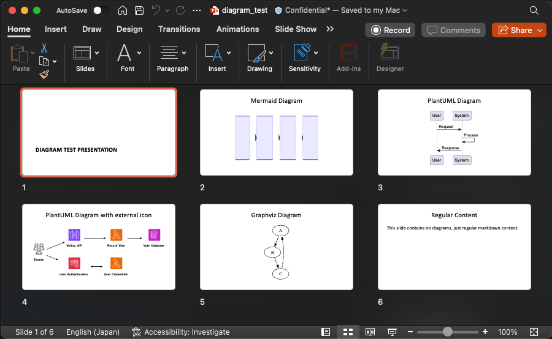

[](https://fastmcp.me/MCP/Details/1200/pandoc-markdown-to-powerpoint)
[](https://fastmcp.me/MCP/Details/1200/pandoc-markdown-to-powerpoint)
[](https://fastmcp.me/MCP/Details/1200/pandoc-markdown-to-powerpoint)
[](https://fastmcp.me/MCP/Details/1200/pandoc-markdown-to-powerpoint)
[](https://fastmcp.me/MCP/Details/1200/pandoc-markdown-to-powerpoint)
[](https://fastmcp.me/MCP/Details/1200/pandoc-markdown-to-powerpoint)

# mcp-pandoc-md2pptx: Markdown to PowerPoint Converter

A Model Context Protocol server for converting Markdown content to PowerPoint (PPTX) presentations using [pandoc](https://pandoc.org/index.html).



## Overview

This MCP server provides a simple tool to transform Markdown content into PowerPoint presentations while preserving formatting and structure. Perfect for creating presentations from documentation, notes, or any Markdown content.

## Tools

1. `convert-contents`
   - Converts Markdown content to PowerPoint (PPTX) format
   - Inputs:
     - `contents` (string): Markdown content to convert (required if input_file not provided)
     - `input_file` (string): Path to Markdown input file (required if contents not provided)
     - `output_file` (string): Complete path for PPTX output file (required)
     - `template` (string): Path to a template PPTX document to use for styling (optional)

## Usage & Configuration

```json
{
  "mcpServers": {
    "mcp-pandoc-md2pptx": {
      "command": "uvx",
      "args": ["mcp-pandoc-md2pptx"]
    }
  }
}
```

## Prerequisites

1. **Pandoc Installation**
   ```bash
   # macOS
   brew install pandoc
   
   # Ubuntu/Debian
   sudo apt-get install pandoc
   
   # Windows
   # Download from: https://pandoc.org/installing.html
   ```

2. **UV Package Installation**
   ```bash
   # macOS
   brew install uv
   
   # Windows/Linux
   pip install uv
   ```

## Examples

### Basic Conversion
```
"Convert this markdown to PowerPoint and save as /presentations/demo.pptx:
# My Presentation
## Slide 1
Content here"
```

### File Conversion
```
"Convert /path/to/input.md to PPTX and save as /path/to/output.pptx"
```

### With Custom Template
```
"Convert markdown to PPTX using /templates/theme.pptx as template and save as /presentations/styled.pptx"
```

## Template Support

Create custom PowerPoint templates for consistent branding:

1. Generate default template:
   ```bash
   pandoc -o template.pptx --print-default-data-file reference.pptx
   ```

2. Customize in PowerPoint with your fonts, colors, and slide layouts

3. Use in conversion:
   ```
   "Convert content using /path/to/template.pptx as template"
   ```

## Installation

### Option 1: Manual Configuration

Add to your Claude Desktop config:
- macOS: `~/Library/Application Support/Claude/claude_desktop_config.json`
- Windows: `%APPDATA%/Claude/claude_desktop_config.json`

```json
{
  "mcpServers": {
    "mcp-pandoc-md2pptx": {
      "command": "uvx",
      "args": ["mcp-pandoc-md2pptx"]
    }
  }
}
```

### Option 2: Smithery (Automatic)

```bash
npx -y @smithery/cli install mcp-pandoc-md2pptx --client claude
```

## Development

### Testing
```bash
uv run pytest
```

### Building
```bash
uv sync
uv build
```

### Publishing
```bash
uv publish
```

## Contributing

1. **Report Issues**: [GitHub Issues](https://github.com/maekawataiki/mcp-pandoc-md2pptx/issues)
2. **Submit Pull Requests**: Improve the codebase or add features

## Acknowledgement

Special thanks to [MCP Pandoc](https://github.com/vivekVells/mcp-pandoc) and [pandoc-ext/diagram](https://github.com/pandoc-ext/diagram)

---

*Simple, focused Markdown to PowerPoint conversion via MCP*
